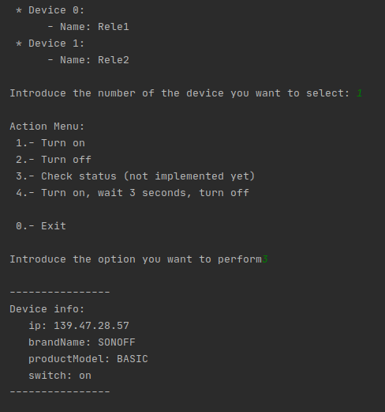

# sonoff_POC

This is just a POC (Proof Of Concept) on how to manage sonoff switches from python.

It uses a sonoff dependency you can find at https://pypi.org/project/sonoff-python/

## Functionality

The main loop has two steps.

On the first one the tool retrieve all sonoff devices on your account so you can choose which one you want to interact with.

On the second step you choose which action do you want to perform. So far we have turn switch on, turn switch off, turn switch on for 3 seconds and then turn it off, and retrieve some information from the switch.



## Configuration

Account configuration has to be place at config.py file.

```python
username=<user_account>
password=<password>
api_region=<region>   # The API region you use, valid ones are apparently 'us', 'eu' and 'cn'
```

Feel free to fork and hope you find it useful. 